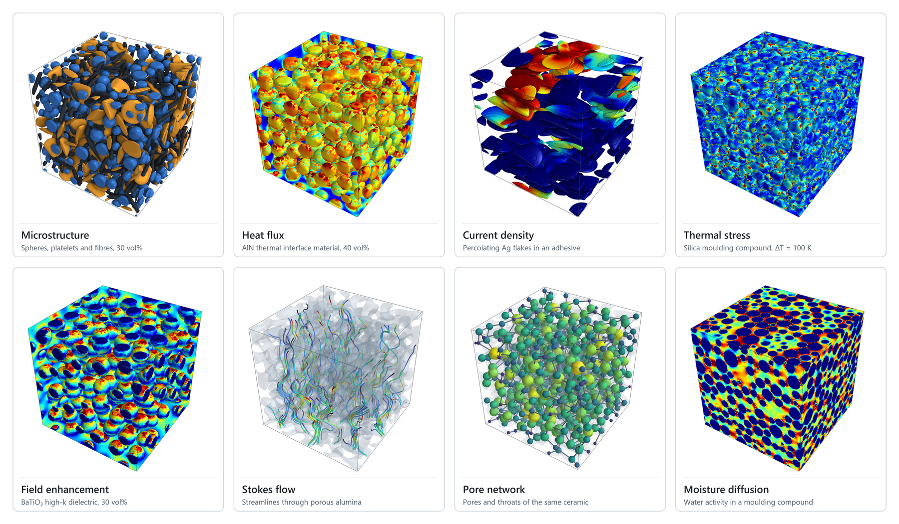
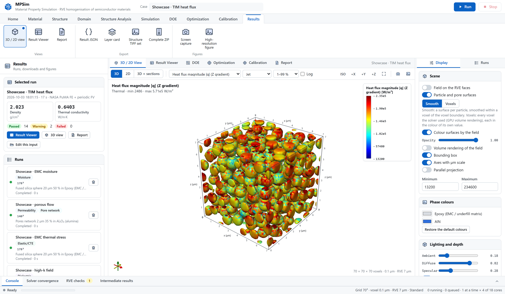
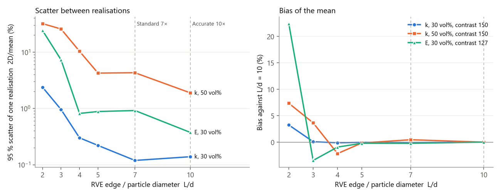

<p align="center">
  <picture>
    <source media="(prefers-color-scheme: dark)" srcset="docs/images/logo_dark.png">
    
  </picture>
</p>

<p align="center">
  
  
  
  
  
  
</p>

<p align="center">
  <b>MPSim (Material Property Simulation)</b> — effective properties of semiconductor materials
  from their microstructure: generated, solved and visualised in the browser.
</p>

<p align="center">
  <a href="#software-description">Description</a> ·
  <a href="#analyses">Analyses</a> ·
  <a href="#verification">Verification</a> ·
  <a href="#installation">Installation</a> ·
  <a href="docs/USER_GUIDE_EN.pdf">User guide</a> ·
  <a href="#citing">Citing</a>
</p>

<p align="center">
  
</p>

## Software description

**MPSim** (**M**aterial **P**roperty **Sim**ulation) computes the effective properties of a material from its
microstructure. It builds
the inside of a material in the computer — fillers of any shape, size distribution and orientation, pores, coatings,
thin films — on a voxel **representative volume element (RVE)**, solves the governing equations on it with validated
open-source solvers, and shows what happened inside: the heat that runs along particle chains, the current that finds
a percolating path, the stress that gathers between fillers, the resin that is sheared in the gaps.

It was written for the materials of semiconductor packaging, devices and process equipment — moulding compounds,
underfills, thermal interface materials, conductive adhesives, low-k and high-k dielectrics, EMI absorbers, porous
ceramics and filters — but the physics is general. The whole workflow runs in one browser workspace:
*define the materials → generate the microstructure → build the voxel grid → check that the RVE is representative →
solve → read the fields, charts and report*. It runs on one PC, or on a server that the rest of the network opens in a
browser; no data leaves the machine.

Its capabilities include:

- **Microstructure generation.** Spheres, spheroids (needles and platelets), cylinders, capsules, cubes, cuboids,
  superellipsoids, polyhedra, helices and connected networks, with full 3D rotation; log-normal size distributions,
  coated and hollow particles, several filler phases in one RVE, pores as a material, gas matrices. Dense packings use
  rigid-clump relaxation and Monte-Carlo compression, and every blend is checked so that **no voxel belongs to two
  particles**.
- **RVE sizing with a measured basis.** The RVE edge is 7× (Standard) or 10× (Accurate) the largest particle, a
  criterion measured with the statistical method of Kanit et al. (2003). Volume-fraction error, octant homogeneity,
  directional scatter and convergence are checked on every run; several realisations give a 95 % confidence interval.
- **Thin films.** x and y periodic, z the real film thickness, particles ending inside the film.
- **Conduction.** Thermal, electrical, dielectric and magnetic conduction with a periodic finite-volume solver
  (multi-core, FFT-preconditioned), with NASA PuMA's finite elements as the alternative; interfacial thermal resistance
  between filler and matrix and at filler–filler contacts is placed on the voxel faces.
- **Mechanics.** Stiffness, engineering constants and the thermal-expansion tensor from FANS — the periodic voxel finite
  elements of NASA PuMA solved with an FFT preconditioner whose iteration count does not grow with the grid
  (7 loads on 96³ in 49 s, 11× faster than MINRES on the same discretisation) — optionally above the glass transition.
- **Rheology.** Effective viscosity of underfills, moulding compounds and pastes from a creeping-flow solve on the RVE,
  Krieger–Dougherty with the maximum packing fraction of the actual size distribution, flow curves, capillary underfill
  filling time and settling; the resin flow is shown moving.
- **Moisture.** Effective moisture diffusivity (solved on the water activity), saturated uptake, the uptake curve of a part
  and hygroscopic swelling.
- **Electromagnetic shielding.** Frequency-resolved complex homogenisation feeding a transmission-line model, with an
  optional full-wave check of the RVE slab in openEMS (FDTD).
- **Porous media.** Permeability (Stokes), filtration efficiency by particle tracking, diffusion and tortuosity, acoustic
  absorption (Johnson–Champoux–Allard), radiative extinction, porosimetry, pore networks, percolation paths and grain
  statistics.
- **Calibration.** Unknown material values — interfacial and contact resistance, the conductivity of a filler grade — from
  measured effective properties: phonon-mismatch theory first, an identifiability check, a Bayesian calibration on an RVE
  surrogate with credible intervals, and the next measurement that would add the most information.
- **Studies.** DOE (full factorial, one factor at a time, Latin hypercube), Gaussian-process surrogates, Sobol sensitivity
  indices, single-objective optima and NSGA-II trade-off fronts.
- **Visualisation.** An interactive 3D view (vtk.js) with particles as smooth surfaces or as the solver's voxels, fields on
  the RVE faces and on XYZ sections, arrows, animated field lines and pore networks; publication figures rendered on the
  server (PyVista); a single-file HTML report for every run.

### The workspace

<p align="center">
  
</p>

The ribbon follows the order of a study (Home → Material → Structure → Domain → Structure Analysis → Simulation →
Results), the command panel on the left holds the inputs of the active tab, the centre shows the 3D/2D view, the
Result Viewer or the report, and the inspector on the right controls what is drawn. Chapter 3 of the user guide walks
through it.

## Analyses

| Group | Analysis | Solver | Main results |
|---|---|---|---|
| Conduction | Thermal conductivity | Periodic FV (default), NASA PuMA FE | k tensor, directional k(n), diffusivity, area-specific resistance, bounds and mean-field models |
| | Electrical conductivity | same | σ tensor, resistivity, sheet resistance, percolation |
| Electromagnetics | Permittivity and loss | same | Dk tensor, Df, local field enhancement per region |
| | Magnetic permeability | same | μr tensor |
| | EMI shielding | Complex homogenisation → scikit-rf; openEMS FDTD check | SE(f) with reflection, absorption and multiple-reflection terms, validity limits |
| Mechanics | Elasticity and thermal expansion | FANS voxel FE (default), NASA PuMA FE | C\*, S\*, E, G, ν, Hill moduli, anisotropy index, α tensor, thermal stress per region; optionally α2 and E above Tg |
| Rheology | Viscosity and flowability | FANS creeping flow; Krieger–Dougherty with Farr–Groot φm | Relative viscosity, flow curve, φm, underfill filling time, settling, local shear-rate field |
| Reliability | Moisture uptake and swelling | Periodic FV on the water activity; FANS eigenstrain | D_eff tensor, saturated uptake, uptake curve, swelling strain and CME |
| Porous media | Permeability | NASA PuMA Stokes FE | K tensor, Kozeny–Carman constant, hydraulic tortuosity |
| | Filtration efficiency | Particle tracking in the Stokes field | Efficiency per particle size, most penetrating size, quality factor |
| | Diffusion and tortuosity | NASA PuMA | τ, D_eff/D₀, formation factor, MacMullin number, Knudsen and Bosanquet diffusivities |
| | Acoustic absorption | JCA model from the computed fields | Absorption, surface impedance, octave bands, NRC |
| Radiation | Radiative extinction | NASA PuMA ray casting | Extinction coefficient, Rosseland k_rad(T) |
| Structure | Porosity and size distributions | PoreSpy, NASA PuMA | Open/closed porosity, local thickness, chords, two-point correlation |
| | Porosimetry | PoreSpy | Intrusion/extrusion curves, bubble points |
| | Pore network | PoreSpy SNOW2 | Pores, throats, coordination numbers |
| | Percolation paths | Connected components, geodesic distance | Spanning fractions, geodesic tortuosity, largest passing sphere |
| | Grain analysis | Particle list, PoreSpy, PuMA structure tensor | Size distribution, sphericity, orientation tensor, spacing, clusters |
| Inverse problems | Calibration | RVE surrogate (Gaussian process), Bayesian posterior | Unknown material values with credible intervals, identifiability, next measurement |

Each result states which method produced it. Conduction and thermal-expansion results are compared with rigorous
bounds (Wiener, Hashin–Shtrikman, Schapery); a value outside a rigorous bound is reported as a failed check.

## Verification

`5_SELF_TEST.bat` solves **54 problems whose answers are known** (38 in the quick set) and compares the results.
Among them:

| Check | Reference | Result |
|---|---|---|
| Series and parallel laminates (bulk and thin film) | 1.81818 / 5.5 | exact |
| Interfacial thermal resistance | Hasselman–Johnson | within 0.26 % |
| Simple cubic sphere array, extrapolated from 256³ | converged reference | 64³: FV +0.7 %, FE +4.0 % |
| Two-phase thermal expansion | Levin's exact relation | relative error 5e-7 |
| Complex laminates (EMI homogenisation) | series/parallel closed form | error 1e-13 |
| Dilute spheres, complex admittivity | Maxwell-Garnett | within 0.06 % |
| Homogeneous slab in openEMS | exact slab transmission | within 0.001 dB |
| Cylindrical pore | Poiseuille; Λ = Λ′ = r | passed |
| Sobol indices of the Ishigami function | closed form | passed |
| FANS elasticity against PuMA (corrected) | same discretisation | 3.5e-9 |
| Dilute rigid sphere in a viscous liquid | Einstein [η] = 2.5 | within 15 % (voxelised sphere) |
| Maximum packing of bidisperse spheres | Farr–Groot simulations, 27 cases | within 0.011 |
| Impermeable sphere, moisture diffusion | Maxwell 2/(2+φ) | within 2 % |
| Calibration of R_int and filler k from two particle sizes | known values 2e-7 m²K/W, 2.0 W/m·K | 2.0e-7, 2.01 |
| Blends: two sphere sizes at 55 vol%, cubes with flakes at 45 vol% | no voxel inside two particles | 0 shared voxels, none trimmed |
| Complete pipelines: filled RVE, thin film, porous RVE, viscosity with live results | all files, all analyses | passed |

**RVE size.** The 7× and 10× criteria come from repeated runs on independent random structures, evaluated with the
statistical method of Kanit et al. (2003). The random scatter of one realisation (95 % interval) was ±0.12 % / ±0.14 %
for the conductivity of 30 vol% fillers, ±4.3 % / ±1.9 % at 50 vol%, and ±0.92 % / ±0.38 % for the Young's modulus at
30 vol% (7× / 10×). The size bias was within the scatter from 5× on.

<p align="center">
  
</p>

Every run also reports its own checks (RVE size, resolution, particle count, convergence, bounds) as passed, warning or
failed, with the reason. Chapter 31 of the user guide explains how to read them.

## Documentation

| | PDF | HTML |
|---|---|---|
| User guide, English (162 pages) | [docs/USER_GUIDE_EN.pdf](docs/USER_GUIDE_EN.pdf) | [docs/guide/user_guide_en.html](docs/guide/user_guide_en.html) |
| User guide, Korean (151 pages) | [docs/USER_GUIDE_KO.pdf](docs/USER_GUIDE_KO.pdf) | [docs/guide/user_guide_ko.html](docs/guide/user_guide_ko.html) |

Every simulation chapter explains how the property is measured in the laboratory, how the program computes it, how to
read each number and rendering, and the assumptions behind it; chapter 32 works through two semiconductor-material
problems from start to finish. The chapters are plain HTML in `docs/guide/parts_en` and `docs/guide/parts_ko`;
`docs/guide/build.py` assembles them and `docs/guide/make_pdf.js` prints the PDFs.

## System requirements

| | Minimum | Recommended |
|---|---|---|
| Operating system | Windows 10 or 11, 64-bit | Windows 11 |
| CPU | 4 cores | 16 or more cores (solvers and independent solves run in parallel) |
| Memory | 16 GB (grids up to about 200³ for conduction, 100³ for elasticity) | 64 GB or more; 512 GB runs 500³ elasticity |
| Disk | 2 GB for the installation, plus the runs | SSD |
| Browser | Chrome or Edge (WebGL 2) | same |

The RVE grid limit is 500³ by default and can be changed per server. The planner estimates the peak memory of each
solver before it runs and warns with the numbers instead of refusing. Estimates per voxel: conduction about
230 bytes (500³ ≈ 29 GB), elasticity about 2.5 kB (200³ ≈ 20 GB, 500³ ≈ 320 GB), Stokes flow about 2.3 kB.

## Installation

The program comes in two forms:

- **The source (this repository)** — installed with conda on a PC with internet access.
- **The offline package** — the same program with the official Python runtime, all 76 wheels and openEMS (about
  380 MB), for PCs without internet. Binaries are not kept in the repository: download the package from the
  [**Releases**](https://github.com/HyoseokByun-opt/MPSim/releases) page, or build it with `tools\build_offline.py` (below).

### With conda (from the source)

On a PC with internet access and Miniconda or Anaconda:

```bat
git clone https://github.com/HyoseokByun-opt/MPSim.git C:\MPSim
cd C:\MPSim
1_INSTALL.bat
```

`1_INSTALL.bat` creates a private environment in `env\` from `environment.yml` (conda-forge) and runs the quick
self-test; by hand it is `conda env create -p .\env -f environment.yml`. Start the program with `2_RUN_LOCAL.bat`.
Keep the folder on a short path such as `C:\MPSim` (see [Common errors](#common-errors)).

NASA PuMA is distributed on conda-forge as the package `puma`. The PyPI project called `pumapy` is an unrelated
package and must not be installed.

### On an offline PC

The offline package contains everything: the official Python 3.11.9 runtime from python.org, 76 wheels (235 MB)
including NASA PuMA, and openEMS. Neither internet nor conda is needed.

1. Copy the whole folder to the offline PC, preferably to a short path such as `C:\MPSim`.
2. Run **`1_INSTALL_OFFLINE.bat`**. It unpacks the runtime into `python\`, installs the wheels with the pinned
   versions, unpacks openEMS into `tools\openEMS`, checks every import and runs the quick self-test. Nothing outside
   the folder is changed (no registry entries, no PATH changes).
3. Start the program with `2_RUN_LOCAL.bat`.

To remove the program, delete the folder.

### Building the offline package

On a PC with internet access and the tested conda environment (`environment.yml`):

```bat
conda run -p .\env python tools\build_offline.py            :: runtime, openEMS, PuMA wheel, 76 wheels
conda run -p .\env python tools\build_offline.py --no-openems
```

PuMA is packed from the conda-forge build into a standard wheel. Its compiled modules import only `python311.dll`,
`VCRUNTIME140.dll` and the Windows C runtime, so the same files work in any CPython 3.11 on 64-bit Windows. The
versions are pinned in `requirements-offline.txt` and `constraints-offline.txt`: PuMA 3.2.2 requires numpy < 2 and
scipy 1.11, and vtk 9.5.2 is pinned together with pyvista 0.47.1.

## Running

| File | Purpose |
|---|---|
| `2_RUN_LOCAL.bat` | This PC only; opens `http://127.0.0.1:8000` in the browser |
| `3_RUN_SERVER.bat` | Serves the local network at `http://SERVER-IP:8000`; `--token auto` adds a shared access token |
| `4_NETWORK_CHECK.bat` | Explains why other PCs cannot connect (changes nothing) |
| `5_SELF_TEST.bat` | Verifies the engine against known answers (`--quick` for the short set) |
| `6_RUN_COMMANDLINE.bat` | Runs a preset without the browser, e.g. `--preset tim_aln --quality fast` |

Workflow in the browser: **Home** (preset) → **Material** → **Structure** (*Generate structure*) → **Domain**
(*Generate voxel grid*) → **Structure Analysis** and **Simulation** (switch analyses on) → **Run** →
**3D / 2D View**, **Result Viewer**, **Report**. **DOE**, **Optimization** and **Calibration** extend a single case to a study.

Server options (`app\run_web.py`):

```text
--host 0.0.0.0            address to listen on (127.0.0.1 = this PC only)
--port 8000
--token auto              shared access token ("auto" generates one)
--workspace PATH          where runs are kept (default: workspace\)
--concurrency 1           jobs solved at the same time
--max-voxels 500          grid limit per edge for conduction; 0 = off
--max-voxels-elastic 500  for elasticity and thermal expansion
--max-voxels-flow 500     for Stokes flow
--check                   report why other machines may not connect, then exit
```

After an update, reload the browser page with **Ctrl+F5** so that it loads the new scripts.

## Project layout

```text
1_INSTALL.bat, 1_INSTALL_OFFLINE.bat … 6_RUN_COMMANDLINE.bat, _common.bat
environment.yml, requirements-offline.txt, constraints-offline.txt
app/
  mpsim/                 engine, independent of the browser
    spec.py              input validation and label table
    rve.py               RVE criteria, automatic sizing, memory estimate
    shapes.py, geometry.py, generate.py      shapes, size distributions, RVE generation (numba)
    solvers/             conduction.py (periodic FV), fans.py and elastic.py (FANS mechanics),
                         viscosity.py (creeping flow), puma_backend.py (NASA PuMA),
                         complex_cond.py and emi.py (EMI), fullwave.py (openEMS)
    morphology.py, poro.py, percolation.py, grains.py, filtration.py, acoustics.py, streamlines.py
    analytical.py        rigorous bounds and mean-field models
    doe.py, optimise.py, calibrate.py        studies, surrogate models, calibration
    visual.py, report.py viewer data, publication figures, HTML report
    pipeline.py          one run end to end
    data/                materials.json (52 materials), presets.json (16 presets)
  web/                   Flask server, job queue, workspace UI (vtk.js)
  run_web.py, run_cli.py, selftest.py
docs/                    user guides (PDF and HTML, English and Korean), chapter sources, README images
tools/                   build_offline.py, check_imports.py, make_download.py
runtime/, wheels/        Python runtime, openEMS and wheels (offline package only, not in the repository)
workspace/               results, kept across restarts (created at the first start)
```

## Common errors

**`WinError 206` or "filename too long" during installation.** A few packages contain deep paths that exceed the
260-character limit of Windows. Move the folder to a short path such as `C:\MPSim`, or enable long paths
(`LongPathsEnabled` = 1 under `HKLM\SYSTEM\CurrentControlSet\Control\FileSystem`, administrator rights needed).

**Other PCs cannot open the server.** Usually the Windows firewall blocks the port or the network profile is
*Public*. Run `4_NETWORK_CHECK.bat` on the server; it lists the addresses and what blocks them. Test from another
PC with `curl -m 5 http://SERVER-IP:8000/healthz`, not with ping.

**`cannot import name 'vtkCapsuleSource'`** or a PuMA import error in a self-made environment. vtk ≥ 9.7 or
numpy ≥ 2 was installed next to PuMA 3.2.2. Install with `constraints-offline.txt` or `environment.yml`, which pin
compatible versions.

**A run stops with a memory warning.** The planner's estimate exceeds the free memory. Reduce the grid (larger
voxel or smaller RVE), solve fewer analyses at once, or lower `--concurrency`.

**The page looks outdated after an update.** The browser keeps the old scripts; reload with Ctrl+F5.

**The full-wave EMI check reports "openEMS not found".** openEMS is looked for in `tools\openEMS`, the
`MPSIM_OPENEMS` environment variable, `C:\openEMS` and the PATH. The offline installer unpacks it into
`tools\openEMS`.

More cases are listed in appendix D of the user guide.

## Citing

If you use MPSim in published work, please cite the software (GitHub shows the citation under
**Cite this repository**, from [CITATION.cff](CITATION.cff)):

> H. Byun, *MPSim: Material Property Simulation*, version 5.0.1 (2026). https://github.com/HyoseokByun-opt/MPSim

and the solvers that produced the results:

- J. C. Ferguson, F. Panerai, A. Borner, N. N. Mansour, "PuMA: the Porous Microstructure Analysis software",
  *SoftwareX* 7, 81–87 (2018).
- J. C. Ferguson, F. Semeraro, J. M. Thornton, F. Panerai, A. Borner, N. N. Mansour, "Update 3.0 to PuMA: the Porous
  Microstructure Analysis software", *SoftwareX* 15, 100775 (2021).
- J. T. Gostick et al., "PoreSpy: A Python toolkit for quantitative analysis of porous media images", *Journal of
  Open Source Software* 4(37), 1296 (2019).
- T. Liebig, A. Rennings, S. Held, D. Erni, "openEMS – a free and open source equivalent-circuit (EC) FDTD
  simulation platform supporting cylindrical coordinates suitable for the analysis of traveling wave MRI
  applications", *International Journal of Numerical Modelling* 26(6), 680–696 (2013).
- A. Arsenovic et al., "scikit-rf: An open source Python package for microwave network creation, analysis, and
  calibration", *IEEE Microwave Magazine* 23(1), 98–105 (2022).
- T. Kanit, S. Forest, I. Galliet, V. Mounoury, D. Jeulin, "Determination of the size of the representative volume
  element for random composites: statistical and numerical approach", *International Journal of Solids and
  Structures* 40(13–14), 3647–3679 (2003) (the RVE size criteria).

## Contributing and bug reports

Bug reports and suggestions are welcome as GitHub issues. Please attach the run folder, or at least its
`spec.normalized.json`, `result.json` and the console log (**Results → Complete ZIP** collects all of them), and state
the version shown in the title bar and the output of `5_SELF_TEST.bat --quick`. Pull requests should keep the
self-test passing and add a check for any new solver or analysis.

## Authors

**Hyoseok Byun** ([@HyoseokByun-opt](https://github.com/HyoseokByun-opt)) — concept, design, direction and validation.

**Declaration of AI assistance.** The code, the verification tests and the user guides were written with the assistance
of Claude (Anthropic; Claude Code with Claude Opus 5.5), an AI assistant, working under the author's direction. The
author reviewed and edited the output and takes full responsibility for the content. Following the practice of
scientific publishing, the AI assistant is acknowledged here rather than listed as an author; commits it helped to
write carry a `Co-Authored-By: Claude` trailer.

The program stands on the open-source projects listed under [License](#license); their authors deserve the credit
for the solvers.

## License

The code and documentation of MPSim are released under the MIT License (see
[LICENSE](LICENSE)). Redistributions must keep the copyright notice and the licence text.

The program builds on the open-source projects below; they are installed from conda-forge or PyPI, and only
vtk.js is included in the repository (`app/web/static/vendor`, with its licence). The offline package
redistributes them unchanged, each under its own licence:

| Component | Licence | Use |
|---|---|---|
| NASA PuMA 3.2.2 | NASA Open Source Agreement 1.3 (licence included in the wheel) | FE conduction, elasticity, Stokes flow, tortuosity, ray casting |
| openEMS v0.37.0-rc3 | GPL-3.0 (CSXCAD LGPL-3.0), run as a separate program; source at [thliebig/openEMS-Project](https://github.com/thliebig/openEMS-Project) | EMI full-wave check |
| PoreSpy, OpenPNM | MIT | Morphology, porosimetry, pore network |
| scikit-rf | BSD-3-Clause | EMI transmission line |
| VTK / PyVista | BSD-3-Clause / MIT | Surfaces, figures |
| vtk.js | BSD-3-Clause | 3D view in the browser |
| NumPy, SciPy, numba, scikit-image, scikit-learn, pandas, Flask, psutil, tifffile, pyamg | BSD or MIT | Numerics, server |
| Matplotlib | Matplotlib licence (PSF-based) | Figures |
| Python 3.11.9 | PSF License | Runtime |
